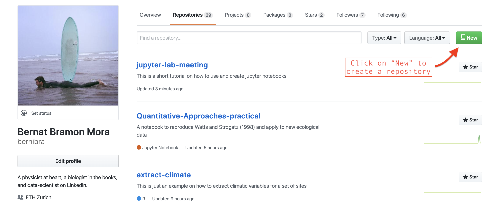
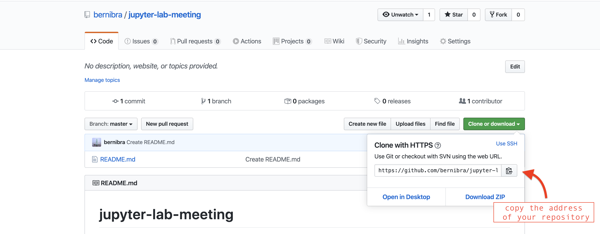
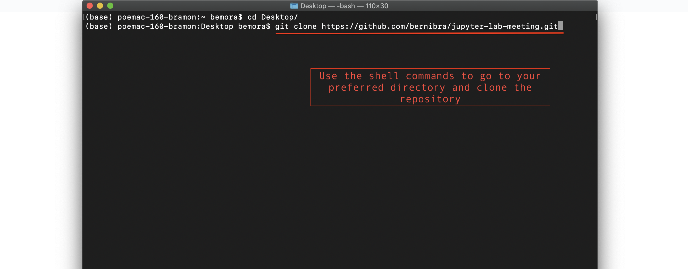

# jupyter-lab-meeting

This is a short tutorial on how to use and create *Jupyter notebooks* for the ETHZ Plant Ecology group (<a href="https://github.com/bernibra/jupyter-lab-meeting/raw/master/presentation/jupyter-presentation.pdf" download>link to presentation slides</a>). The making of this tutorial was motivated by the notebooks developed for the master's course "Quantitative Approaches to Plant Ecology and Community Ecology" during the COVID-19 outbreak. For example, in [this notebook](https://mybinder.org/v2/gh/bernibra/Quantitative-Approaches-practical/master?filepath=index.ipynb), we reproduced the work of [Watts and Strogatz (1998)](https://www.nature.com/articles/30918), studying the small-world features presented by many real networked systems.

A *Jupyter notebook* is a web-based interactive computational environment for creating documents that combine text and executable code. In order to develop a jupyter notebook for a lecture, we will need basic knowledge of [Git+Github](https://guides.github.com/activities/hello-world/) and [basic shell commands](https://www-xray.ast.cam.ac.uk/~jss/lecture/computing/notes/out/commands_basic/). 

_If you are from ETH, you likely have an expensive MacBook pro; therefore, make sure you also have Xcode installed (from App Store)._

## Install Jupyter and explore how to make a notebook
While *Jupyter Notebooks* can be written in many different programming languages (including *R*), *Python* is a requirement and you will need to have it in your computer to be able to develop notebooks. If you have *Python* in your computer already, congratulations, *Python* is one of the [most used](http://pypl.github.io/PYPL.html) programming languages in the world and might get you a job if this 'science thing' doesn't work out. Otherwise, you can use [Anaconda](https://www.anaconda.com/distribution/) to install *Python* and *Jupyter*. If you've got Anaconda already, open a [Terminal](https://raw.githubusercontent.com/bernibra/jupyter-lab-meeting/master/gifs/terminal.gif) and run the following:
```
conda install -c conda-forge jupyterlab
```

Once you have *Python* and *Jupyter* in your computer, you just need to run an additional command in the terminal to be able to use R code in your notebooks:
```
conda install -c r r-essentials
```

Starting a Jupyter notebook is as easy as opening a terminal and typing "jupyter notebook":


*Datacamp* has a [nice tutorial](https://www.datacamp.com/community/tutorials/tutorial-jupyter-notebook) on some of the basics regarding *Jupyter notebooks*. Also, if you are not keen on using the command line, you could consider installing the [graphical installer](https://docs.anaconda.com/anaconda/install/mac-os/) of Anaconda, and [get jupyter](https://docs.anaconda.com/anaconda/navigator/tutorials/r-lang/) via their user friendly interface

## Create a Github repository for your lecture
While playing around with *Jupyter notebooks* is easy peasy, being able to use these for lectures requires a bit more work. The reason is that *Jupyter notebooks* come with a bunch of dependencies, from the *R* or *Python* versions used in the notebook to the different libraries required by your code. One solution would be to use [Docker](https://www.docker.com/), an amazing software that helps you stop worrying about your dependencies when sharing code. For the sake of simplicity, however, we will build lectures using *Github* and *Binder* that simplify the creation of virtual environments.

First, you will need a [Github account](https://github.com/), which provides free hosting for software development version control using Git. In order to manage Github repositories, you will also need to have Git installed in your computer (version control software that can be [easily installed](https://git-scm.com/book/en/v2/Getting-Started-Installing-Git) if you don't have it already).

Once you've created a Github account and installed Git in your laptop, you can create a [new public repository](https://help.github.com/en/github/getting-started-with-github/create-a-repo) and [clone it](https://help.github.com/en/github/creating-cloning-and-archiving-repositories/cloning-a-repository) to your computer. If you are very uncomfortable using the terminal, you could consider using the [Github Desktop](https://desktop.github.com/).

[<kbd>
  
  Step 1
</kbd>](https://raw.githubusercontent.com/bernibra/jupyter-lab-meeting/master/photos/new-repo.png)
[<kbd>
  
  Step 2
</kbd>](https://raw.githubusercontent.com/bernibra/jupyter-lab-meeting/master/photos/create-repo.png)
[<kbd>
  
  Step 3
</kbd>](https://raw.githubusercontent.com/bernibra/jupyter-lab-meeting/master/photos/clone-repo.png)
[<kbd>
  
  Step 4
</kbd>](https://raw.githubusercontent.com/bernibra/jupyter-lab-meeting/master/photos/clone-terminal.png)

## Initializing a notebook in the new repository: add, commit, push and repeat.

Now you have an online repository where you can build your *Jupyter notebook*. To do so, access your repository using the terminal (`cd ~/path/to/directory/`) and open a *Jupyter notebook* as shown above.

The problem now is that any changes that you make to your notebook will only be stored locally. To push them to your online repository, you can use the basic *git* commands to add, commit and push the changes. For example, if you have created a notebook named "index.ipynb", you can add the changes to your online repository using the following command lines in the terminal:
```
git add index.ipynb
git commit -m "adding first file to repository"
git push
```

## Build jupyter notebooks in a virtual environment using Binder.
Although you now have your notebook online, this is not going to work as such. For it to work, students would have to download it and try to run it in their own computer. The problem is that they would need to have all the software that you are using in your computer also installed their own computers (*Python, R, Jupyter Notebooks, libraries,...*). This is obviously not optimal if you are giving a lecture and want things working quickly.

This is where *Binder* (and *Docker*) works beautifully with *Github*. *Binder* will create a virtual environment and generate a link to access it. In this environment, students will be running the same R version, libraries and dependencies that you want.

To make [*Binder*](https://mybinder.org/) work, you need to add [a few files](https://github.com/binder-examples/r) in your repository that specify your dependencies. For example, you will need a file called `runtime.txt`, where you tell *Binder* when you created the notebook so that it can use the R version or the versions of the different libraries that you had at that moment you created your notebook. Likewise, you can specify the *R* libraries that you are using in a file called `install.R`. 

## Add jupyter extensions and interactive tools.
There are several additional features that you can incorporate into your *Jupyter notebooks*, from [additional extensions](https://jupyter-contrib-nbextensions.readthedocs.io/en/latest/install.html#) to [interactive surveys](https://www.kobotoolbox.org/).
