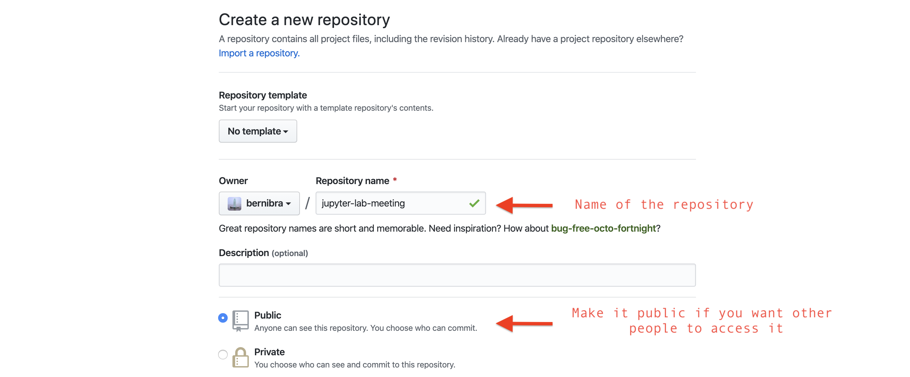

# jupyter-lab-meeting

This is a short tutorial on how to use and create jupyter notebooks for the ETHZ Plant Ecology group. The making of this tutorial was motivated by the notebooks developed for the module for the Quantitive Approaches to Plant Ecology and Community Ecology during the COVID-19 outbreak. For example, in [this notebook](https://mybinder.org/v2/gh/bernibra/Quantitative-Approaches-practical/master?filepath=index.ipynb), we reproduced the results of [Watts and Strogatz (1998)](https://www.nature.com/articles/30918) on the small-world features that are present in many real networked systems.

A jupyter notebook is a web-based interactive computational environment for creating documents that combine text and code that can be run. In order to develop a jupyter notebook for a lecture, we will need basic knowledge of [Git+Github](https://guides.github.com/activities/hello-world/) and [basic shell commands](https://www-xray.ast.cam.ac.uk/~jss/lecture/computing/notes/out/commands_basic/). If you are from ETH, you likely have an expensive MacBook pro; therefore, make sure you also have Xcode installed (from App Store).

## Install Jupyter and explore how to make a notebook
While *Jupyter Notebooks* can be written in many different programming languages (including *R*), *Python* is a requirement and you will need to have it in your computer to be able to develop notebooks. If you have *Python* in your computer already, congratulations, *Python* is one of the [most used](http://pypl.github.io/PYPL.html) programming languages in the world and might get you a job if this 'science thing' doesn't work out. Otherwise, you can use [Anaconda](https://www.anaconda.com/distribution/) to install *Python* and *Jupyter*. If you've got Anaconda already, open a [Terminal](https://raw.githubusercontent.com/bernibra/jupyter-lab-meeting/master/gifs/terminal.gif) and run the following:
```
conda install -c conda-forge jupyterlab
```

Once you have *Python* and *Jupyter* in your computer, you just need to run an additional command in the terminal to be able to use R code in your notebooks:
```
conda install -c r r-essentials
```

Starting a Jupyter notebook is as easy as opening a terminal and typing "jupyter notebook":


*Datacamp* has a [nice tutorial](https://www.datacamp.com/community/tutorials/tutorial-jupyter-notebook) on some of the basics regarding Jupyter notebooks. Also, if you are not keen on using the command line, you could consider installing the [graphical installer](https://docs.anaconda.com/anaconda/install/mac-os/) of Anaconda, and [get jupyter](https://docs.anaconda.com/anaconda/navigator/tutorials/r-lang/) via their user friendly interface

## Create a Github repository for your lecture
While playing around with *Jupyter notebooks* is easy peasy, being able to use these for lectures requires a bit more work. The reason is that jupyter notebooks come with a bunch of dependencies, from the R or Python versions that you use to the different libraries that are required by your code. One solution would be to use [Docker](https://www.docker.com/), an amazing software that helps you stop worrying about your dependencies when sharing code. For the sake of simplicity, however, we will build lectures using Github and Binder that simplify the creation of virtual environments.

First, you will need a [Github account](https://github.com/), which is a company that provides free hosting for software development version control using Git. In order to manage Github repositories, you will also need to have Git installed in your computer (version control software that can be [easily installed](https://git-scm.com/book/en/v2/Getting-Started-Installing-Git) if you don't have it already).

Once you've created a Github account and installed Git in your laptop, you can create a [new public repository](https://help.github.com/en/github/getting-started-with-github/create-a-repo) and [clone it](https://help.github.com/en/github/creating-cloning-and-archiving-repositories/cloning-a-repository) to your computer. If you are very uncomfortable using the terminal, you could consider using the [Github Desktop](https://desktop.github.com/).

 

## Initializing a notebook in the new repository: add, commit, push and repeat.

Now you have an online repository that

## Build jupyter notebooks in a virtual environment using Binder.

## Add jupyter extensions and interactive tools.
